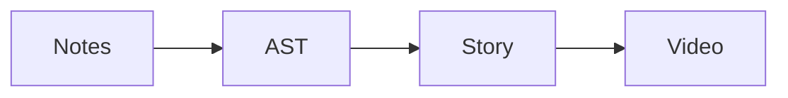

# Release Gate Compiler

Release Gate Compiler turns scattered release notes into a runnable approval workflow. It is the source of truth for scope, validation, and evidence.

## Manual Releases Are Fragile

Engineers must remember which checks are required before deployment. The release coordinator depends on Jira, CI, and a browser dashboard.

- Collect changes
- Request review
- Run validation
- Approve deployment

## Compiler Workflow

1. Parse release notes
2. Build a semantic model
3. Plan the story
4. Render an operator video

| Phase | Evidence |
| --- | --- |
| Parse | Document AST |
| Validate | CI report |

Read the [runbook](https://example.com/runbook) before production approval.
